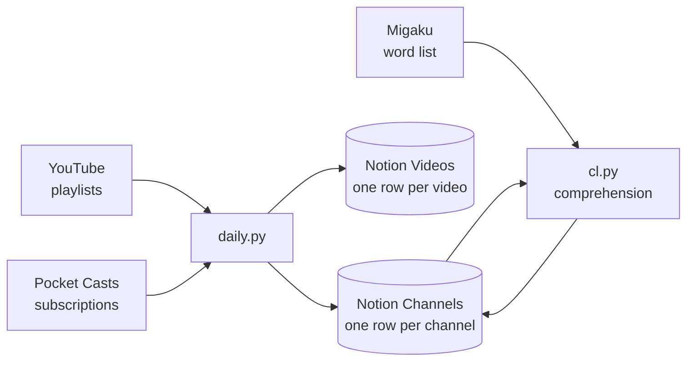

<h1 align="center">notube</h1>
<p align="center"><b>Your YouTube and podcast library in Notion, scored for comprehension</b></p>
<p align="center">
  
  
  
</p>



A daily job drains your YouTube inbox playlists and Pocket Casts subscriptions into one
Notion database, one row per channel or show, and mirrors every other playlist as a
video-level backup. Separate tools then score each channel against your own known-word
list, so the table can tell a learner which channels they are ready for.

## What it does

- **Inbox playlists become rows.** Every channel in a playlist named in `notube/config.py` gets a Channels row with metadata, tag and queue status; the playlist is emptied.
- **Podcasts join the table.** Every subscribed Pocket Casts show gets a row; unsubscribing moves it to the review queue.
- **Language and pictures.** New rows get a `Lang` value from Claude Haiku via the `claude` CLI, and an imported avatar or cover.
- **Playlists are backed up.** Every other playlist, Watch Later included, is mirrored one row per video; dead entries are archived and pruned.
- **Comprehension, on demand.** `cl.py` reads a channel's freshest subtitles and writes the share of words you already know.
- **Difficulty, on demand.** `level.py` has a model rate transcript excerpts on a CEFR-anchored 1 to 10 scale, blind to the channel.
- **Failures stay contained.** Every stage is isolated, the run prints one delta line per stage, and the exit code says whether anything needs attention.

## Quick start

```sh
git clone https://github.com/constkolesnyak/notube-lang.git
cd notube-lang
uv sync
cp .env.example .env                       # Notion secret, database ids, OAuth client
$EDITOR notube/config.py                   # the exact titles of your inbox playlists
uv run python -m notube.daily --dry-run    # show what would change, write nothing
uv run notube-daily                        # the same as python -m notube.daily
```

Needs Python 3.13 with [uv](https://docs.astral.sh/uv/), a Notion integration shared with
both databases, and a Google OAuth client with the YouTube Data API enabled. Chrome logged
into youtube.com empties playlists; Pocket Casts, `claude`, Node and Migaku are optional.

## How it works

Reads go through the YouTube Data API on a read-only OAuth scope. Writes never touch it:
a playlist edit costs 50 of the day's 10,000 quota units, so `innertube.py` drives
YouTube's own internal API with the cookies of your logged-in browser instead.

Language classification, difficulty rating and podcast topics run through the `claude`
CLI, with no API key. Comprehension is computed locally: subtitles are tokenised by
Migaku's own analyzer and compared with the word list read out of Chrome's IndexedDB.

Everything a run produces lands under `run/`, so reruns are cheap and idempotent.

<details>
<summary><b>Writing to YouTube without quota</b></summary>

- `SAPISIDHASH` auth: each request is signed with `SHA1(timestamp SAPISID origin)`,
  recomputed from the cookie jar, exactly as the website does. A profile with several
  Google logins is probed by `authuser` index until the one owning your channel answers.
- Removing a video needs its `setVideoId`. InnerTube's listing is unreliable past ~100
  items, so ids come from the Data API read and only the write goes through InnerTube.
- Watch Later is invisible to the Data API, so it is read through InnerTube; an empty
  read is re-checked by a fresh session before anything is deleted.
- Headless hosts use an exported `cookies.txt` (`NOTUBE_COOKIES_FILE`): the rotating
  `__Secure-*PSIDTS` cookie is refreshed each run and `yt_keepalive.py` tops it up in
  between. A live Chromium profile is kept browsing by `yt_session_refresh.py`.
- `InnerTube.anonymous()` is the same transport signed out; `posts.py` reads posts with it.

</details>

<details>
<summary><b>Comprehension scoring</b></summary>

| Field | Meaning |
|---|---|
| `Subs` | `No` / `Auto` / `Manual`, majority over the 3 freshest normal videos |
| `CL` | share of subtitle words already known, every occurrence counted |
| `CL Content` | the same over nouns, verbs, adjectives and adverbs only |
| `CL Unique` | known share of distinct lemmas in a fixed 2,000-token draw |
| `Speed` | spoken words per minute over the sampled videos |

- A normal video is neither a Short (vertical, at most 3 minutes), a stream, nor under a
  minute long. Three videos is the floor; older ones are added until there is enough text.
- Machine-translated caption tracks are rejected, or an English channel would score as
  German-subtitled and the number would measure Google Translate.
- `cl.py --check` gates a new language: it measures how many lemmas Migaku's vocabulary
  recognises at all, and refuses below 80%.
- `level.py` is the independent check on CL: each channel is rated twice on disjoint
  excerpts, and the driver (lexis, speed, syntax, dialect, topic) needs both to agree.

</details>

<details>
<summary><b>The <code>claude</code> CLI as a transport</b></summary>

`claude.py` wraps one `claude -p` call and returns the reply, token usage and cost. Every
call carries a fixed harness overhead, so requests are batched (dozens of items each),
replies are matched on an echoed id, and a short reply is re-asked rather than trusted.

</details>

<details>
<summary><b>Notion schema</b></summary>

Rows are matched by `YT Channel ID` or `PC ID`, then by normalised `Link`, so reruns never
duplicate. `Status` needs the options in `notube/config.py`; scorers skip `Dropped`/`Skip`.

- **Channels, written by the sync:** `Name`, `Link`, `Tags`, `Rating`, `Status`, `Lang`,
  `Type` (empty for channels), `YT Channel ID`, `YT Keywords`, `YT Description`,
  `YT Channels`, `YT Links`, `YT Uploads`, `YT Saved`, `PC ID`, `PC Author`,
  `PC Description`, `PC Feed`, `PC Cover`, plus `PC Index` and `Topic` for the topics tool.
- **Channels, created by the tools:** `Avatar`, `Subs`, `CL`, `CL Unique`, `CL Content`,
  `Speed`, `Level`, `Level Driver`, `Flags`.
- **YT Videos Backup:** `Name`, `Link`, `Video ID`, `Channel`, `Channel Link`,
  `YT Channel ID`, `YT Keywords`, `YT Uploads`, `YT Description`, `Duration`,
  `Published`, `Thumbnail`, `Playlists`, `Playlist Links`, `Unavailable`.

</details>

## Configuration

Secrets and paths live in `.env` (see [`.env.example`](.env.example)); your library lives
in [`notube/config.py`](notube/config.py): `INBOX`, `LANGS`, `CL_LANGS`, `BACKUP_WATCH_LATER`, `POSTS_*`.

| Variable | Required | Meaning |
|---|---|---|
| `NOTION_API_KEY` | yes | Notion internal integration secret |
| `NOTION_CHANNELS_DB` | yes | id of the Channels database |
| `NOTION_VIDEOS_DB` | yes | id of the YT Videos Backup database |
| `GOOGLE_CLIENT_SECRET_JSON` | yes | Google OAuth client JSON, one line |
| `GOOGLE_TOKEN_JSON` | auto | OAuth token, written after the first login |
| `NOTUBE_BROWSER` | no | browser to read cookies from (default `chrome`) |
| `NOTUBE_CHROME_PROFILE` | no | custom Chrome or Chromium user-data-dir |
| `NOTUBE_COOKIES_FILE` | no | Netscape `cookies.txt`, beats the browser |
| `POCKETCASTS_EMAIL` | no | Pocket Casts login; stage skipped if unset |
| `POCKETCASTS_PASSWORD` | no | Pocket Casts password (no API key exists) |
| `NOTUBE_YT_CHANNEL_ID` | no | `UC` id of the channel owning the playlists |
| `NOTUBE_YT_AUTHUSER` | no | pin the account index of a multi-login jar |
| `NOTUBE_PC_BACKUP_ROOT` | no | snapshot dir (default `run/pocketcasts-backups`) |
| `NOTUBE_CLAUDE_BIN` | no | path to the `claude` CLI if not on `PATH` |
| `NOTUBE_CHROMIUM_BIN` | no | system Chromium (default `/usr/bin/chromium`) |

## Commands

Run as `uv run python -m notube.<module>` (`--help` where there are options); `notube-daily` is a shortcut for `daily`.

| Module | What it does |
|---|---|
| `daily [--dry-run]` | the daily sync: inbox, podcasts, language, backup |
| `cl [--lang L] [--check]` | comprehension scores for one language's channels |
| `level [--lang L]` | difficulty rating from transcripts via the `claude` CLI |
| `subs [--lang L] [--reuse]` | the subtitle sample `cl` scores (run by `cl` itself) |
| `lang`, `avatars` | standalone runs of the language and picture stages |
| `posts [--json]` | community posts matching `POSTS_TERMS` |
| `pocketcasts_order <cmd>` | back up, diff, restore or swap the list order |
| `pocketcasts_sort [--write]` | keep the middle block of that list sorted by episodes |
| `pocketcasts_topics [--write]` | rebuild `PC Index`; tag new podcasts with a `Topic` |
| `yt_session_refresh`, `yt_keepalive` | keep a Chromium profile or cookie jar logged in |
| `yt_dead`, `clone_playlist` | tag dead channels; copy a playlist |
| `count_units`, `migaku`, `migaku_tok` | API unit count; word-list stats; tokenizer setup |

## Project layout

```text
notube-lang/
├── notube/                          the package; every tool is a module in it
│   ├── daily.py                     orchestration and the one-screen report
│   ├── config.py                    your library: inbox playlists, languages, terms
│   ├── channels_sync.py  videos_sync.py   playlists -> Channels rows / video backup
│   ├── youtube.py  innertube.py        Data API reads; cookie-authenticated writes
│   ├── notion.py  claude.py            Notion client; one `claude -p` call
│   ├── pocketcasts*.py                 API, sync, list order, sort, topics
│   ├── subs.py  cl.py  level.py        subtitles -> comprehension -> difficulty
│   ├── migaku.py  migaku_tok.py        word list from Chrome; analyzer sidecar
│   ├── posts.py  avatars.py  lang.py  yt_*.py  clone_playlist.py  count_units.py
│   └── data/pocketcasts-shelves.json   hand-curated shelves the sorter leaves alone
└── run/                             git-ignored: logs, state, subtitles, caches
```

## Development

```sh
uv sync && uvx ruff check .              # line length 110; compact imports by design
uv run python -m compileall -q notube    # what CI runs after the lint
```

CI runs the lint and the byte-compile on each push and pull request. There is no unit-test
suite: everything talks to live services and a logged-in browser.

## License

[MIT](LICENSE).
